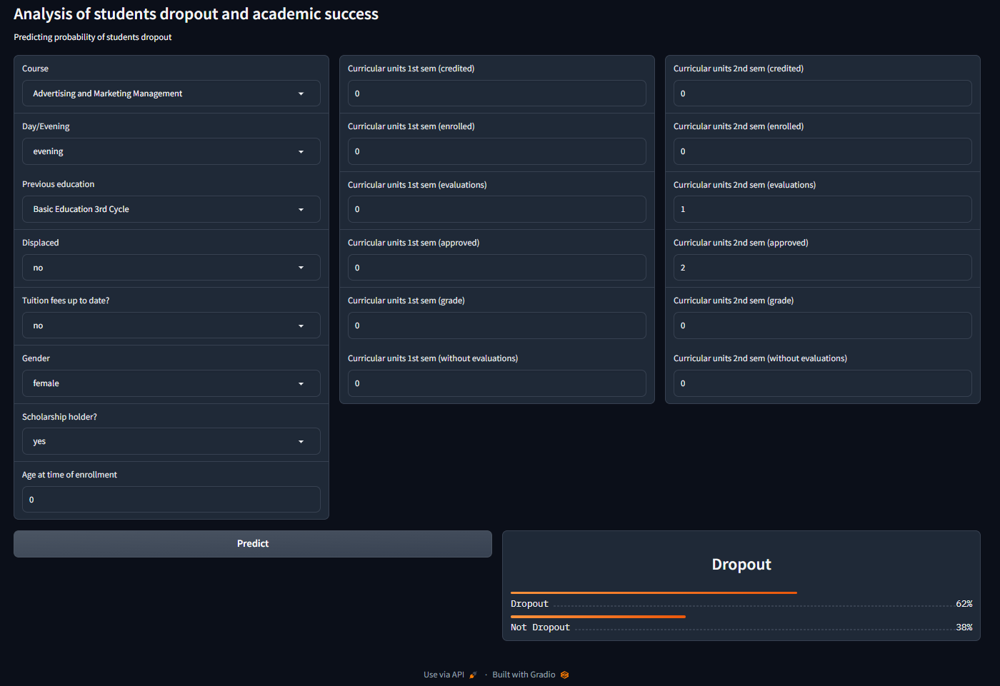

# Analysis of students dropout and academic success

In this project I will be analyzing dataset created from a higher education institution from Portugal related to students enrolled in different undergraduate degrees. The goal of this project is to predict the probability of dropout of the students based on indicators available at an early point of their carrers. With this information, the institutions could focus their resources in the students with the highest dropout probability, and hopefully prevent that situation.

The dataset target column is divided into 3 categories: 'Graduate', 'Enrolled' and 'Dropout'. This is because the student situation is measured at the end of the expected date of graduation. The students with a value equal to 'Enrolled' are those who are still studying at the end of this period, since they couldn't graduate on time. For this project I will focus on predicting only 'Dropout', that's why I will change the target variable only to one named 'Dropout' and boolean values of 0 (not dropout) and 1 (dropout).

## Dataset Information

The dataset is available to download in [this link](https://zenodo.org/record/5777340#.Y7FJotJBwUE), and the related paper is available in [this link](https://www.mdpi.com/2306-5729/7/11/146). I decide not to read the paper before doing the analysis because I don't want my analysis to be biased by the conclusions of the paper. At the end, I will be doing a comparison between my conclusions and the one in the paper.

As mentioned, the dataset was created from a higher education institution (acquired from several disjoint databases) related to students enrolled in different undergraduate degrees, such as agronomy, design, education, nursing, journalism, management, social service, and technologies. The dataset includes demographic data, socioeconomic and macroeconomic data, data at the time of student enrollment (academic path, demographics, and social-economic factors), and data at the end of the first and second semesters. The data sources used consist of internal and external data from the institution and include data from (i) the Academic Management System (AMS) of the institution, (ii) the Support System for the Teaching Activity of the institution (developed internally and called PAE), (iii) the annual data from the General Directorate of Higher Education (DGES) regarding admission through the National Competition for Access to Higher Education (CNAES), and (iv) the Contemporary Portugal Database (PORDATA) regarding macroeconomic data.

The data refer to records of students enrolled between the academic years 2008/2009 (after the application of the Bologna Process to higher education in Europe) to 2018/2019. These include data from 17 undergraduate degrees from different fields of knowledge. The final dataset is available as a comma-separated values (CSV) file encoded as UTF8 and consists of 4424 records with 35 attributes.

In the dataset, all the categorical columns are encoded as numeric. The original categories are not easily available in a file, but we can scrap them from [this website](https://valoriza.ipportalegre.pt/piaes/features-info-stats.html), this is done in the [web_scraper notebook](notebooks/web_scraper.ipynb). After scrapping, the results are storaged in a dictionary ([categorical_maps.pkl](data/categorical_maps.pkl)), where the keys are the column names of the original dataset and the values are also dictionaries containing the mappings for each category. Here is a sample of the first key-value of that dictionary:

`'marital_status': {1: 'Single',  
              2: 'Married',  
              3: 'Widower',  
              4: 'Divorced',  
              5: 'Facto union',  
              6: 'Legally separated'}`

**Note:** The scraped site change it's format after I made this project. The current site doesn't have the information I scrapped anymore. If you try to reproduce all the steps of the project you will have an error running the scraper notebook. You can still access this data in the [categorical_maps.pkl](data/categorical_maps.pkl) file.

The next step is the cleaning of the data, which is done in [data_cleaning.ipynb](notebooks/data_cleaning.ipynb)

## Data Cleaning

The data cleaning processing of this data is simple:

1. Convert the column names to lowercase.
2. Rename column 'nacionality' to 'nationality'.
3. Change the target column categories to only 'Dropout' and 'Not Dropout'.
4. Convert categorical data from numeric to string categories.
5. Perform further cleaning of the column names
6. Since some categorical columns have a high cardinality, I lump some categories together to reduce this cardinality and improve machine learning models.
7. Reorder the education and target categorical variables.
8. Split the data into train and test set for evaluation of the machine learning models.

## Exploratory Data Analysis

The exploratory data analysis is divided into sections

1. Analysis of missing values and descriptive statistics
2. Target variable analysis
3. Univariate analysis
4. Bivariate analysis
5. Correlation analysis
6. Dimensionality reduction
7. Questions

Please explore the document for details

## Feature engineering and selection

In this notebook I use create many new variables and use feature selection methods to select the best ones. The feature selection methods implemented are:

1. Variance threshold Analysis
2. Univariate feature selection
   1. ANOVA F-value
   2. Mutual information
3. Sequential feature selection
4. Selection by feature importance
5. Manual Selection based on the EDA

## Models

In this notebook I trained different models and compare their performance. The final model is a tuned Random Forest Classifier.

## Gradio app

Web interface application that allows the user to introduce the values and get a dropout prediction

The app is depoyed in [**Hugging Face Spaces**](https://huggingface.co/spaces) and you can find it in [**this link**](https://huggingface.co/spaces/matiast1905/student_dropout_analysis)
